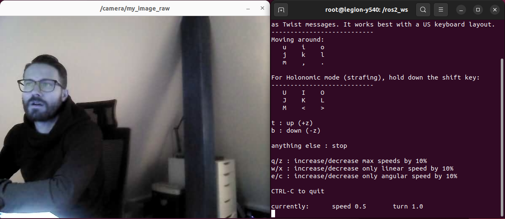

# rosbot-telepresence

Controlling robot in real-time over the internet with a video streaming



## Clonning the repo

This repository contains the Docker Compose setup for both PC and ROSbot. You can clone it to both PC and ROSbot, or use the `./sync_with_rosbot.sh` script to clone it to your PC and keep it synchronized with the robot

```bash
git clone https://github.com/husarion/rosbot-slam
cd rosbot-slam 
export ROSBOT_ADDR=10.5.10.123 # Replace with your own ROSbot's IP or Husarnet hostname
./sync_with_rosbot.sh $ROSBOT_ADDR
```

## Flashing the ROSbot Firmware

Execute in the ROSbot's shell:

```bash
docker stop rosbot microros || true && docker run \
--rm -it --privileged \
husarion/rosbot:humble \
/flash-firmware.py /root/firmware.bin
```

## Configuration

### Choosing the Network (DDS) Config

Edit `net.env` file and uncomment one of the available configs:

```bash
# =======================================
# Network config options (uncomment one)
# =======================================

# 1. Fast DDS + LAN
RMW_IMPLEMENTATION=rmw_fastrtps_cpp

# 2. Cyclone DDS + LAN
# RMW_IMPLEMENTATION=rmw_cyclonedds_cpp

# 3. Fast DDS + VPN
# RMW_IMPLEMENTATION=rmw_fastrtps_cpp
# FASTRTPS_DEFAULT_PROFILES_FILE=/husarnet-fastdds.xml

# 4. Cyclone DDS + VPN
# RMW_IMPLEMENTATION=rmw_cyclonedds_cpp
# CYCLONEDDS_URI=file:///husarnet-cyclonedds.xml
```

If you choose to use the VPN option, both your ROSbot and laptop must be connected to the same Husarnet network. Follow the guide [here](https://husarion.com/manuals/rosbot/remote-access/).

### Choosing the video compression

Edit `.env` file and uncomment one of the available configs:

```bash
# using "compressed" codec from image_transport_plugins
# CODEC=compressed

# using "theora" codec from image_transport_plugins
CODEC=theora
```

## Running

### PC

```bash
xhost +local:docker && \
docker compose -f compose.pc.yaml up -d
```

Now to control the robot use [a gamepad](https://husarion.com/tutorials/other-tutorials/rosbot-gamepad/) or open a teleop interface:

```
docker exec -it interface bash
```

And inside the running container shell execute:

```bash
ros2 run teleop_twist_keyboard teleop_twist_keyboard
```

To turn off run:

```bash
docker compose -f compose.pc.yaml down
```

### ROSbot

```bash
docker compose up
```

## Usefull tips

**1. Checking a datarate**

If you want to check the datarate generated by a video stream:

```bash
husarion@rosbot:~$ ifstat -i wlan0
      wlan0       
 KB/s in  KB/s out
    6.83   2744.66
    1.67   2659.88
    1.02   2748.40
    6.73   2565.20
    1.02   2748.65
    1.18   2749.64
```

**2. Sending uncompressed video frames over the network**

If raw image data is being transmitted over the network, you need to perform some [DDS-tunning](https://docs.ros.org/en/humble/How-To-Guides/DDS-tuning.html) (both on ROSbot and PC):

For configs in LAN:

```bash
sudo sysctl -w net.ipv4.ipfrag_time=3 # 3s
sudo sysctl -w net.ipv4.ipfrag_high_thresh=134217728 # (128 MB)
```

For configs over VPN:

```bash
sudo sysctl -w net.ipv6.ip6frag_time=3 # 3s
sudo sysctl -w net.ipv6.ip6frag_high_thresh=134217728 # (128 MB)
```