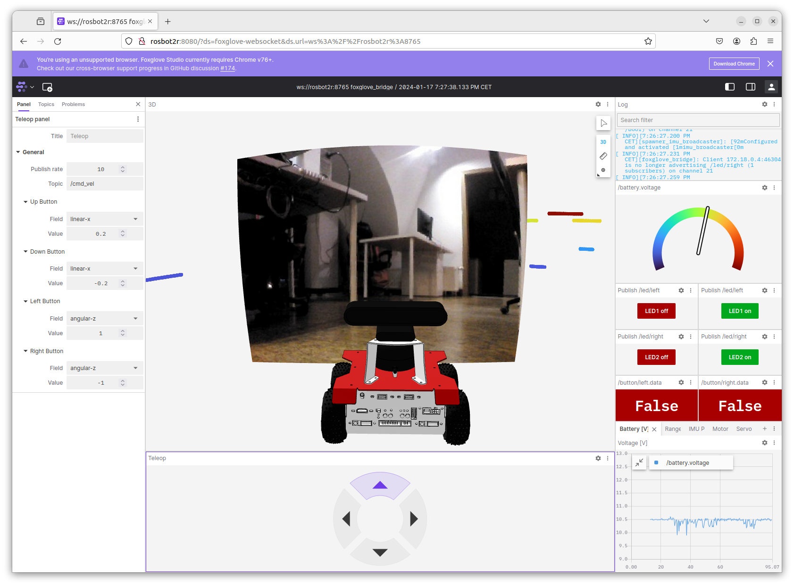

# rosbot-telepresence

Operating a ROSbot Manually via the Internet with a Real-Time Camera Feed on a Web User Interface.



There are two different setups on two separate branches:
- [**ros2router**](https://github.com/husarion/rosbot-telepresence/tree/ros2router)
- [**foxglove**](https://github.com/husarion/rosbot-telepresence/tree/foxglove) (the current one)

## Quick start

> [!NOTE]
> To simplify the execution of this project, we are utilizing [just](https://github.com/casey/just).
>
> Install it with:
>
> ```
> curl --proto '=https' --tlsv1.2 -sSf https://just.systems/install.sh | sudo bash -s -- --to /usr/bin
> ```

To see all available commands just run `just`:

```bash
husarion@rosbot2r:~/rosbot-telepresence$ just
Available recipes:
    connect-husarnet joincode hostname # connect to Husarnet VPN network
    flash-firmware # flash the proper firmware for STM32 microcontroller in ROSbot 2R / 2 PRO
    start-rosbot   # start containers on ROSbot 2R / 2 PRO
    sync hostname password="husarion" # copy repo content to remote host with 'rsync' and watch for changes
```

### 🌎 Step 1: Connecting ROSbot and Laptop over VPN

Ensure that both ROSbot 2R (or ROSbot 2 PRO) and your laptop are linked to the same Husarnet VPN network. If they are not follow these steps:

1. Setup a free account at [app.husarnet.com](https://app.husarnet.com/), create a new Husarnet network, click the **[Add element]** button and copy the code from the **Join Code** tab.
2. Run in the linux terminal on your PC:
   ```bash
   cd rosbot-telepresence/ # remember to run all "just" commands in the repo root folder
   export JOINCODE=<PASTE_YOUR_JOIN_CODE_HERE>
   just connect-husarnet $JOINCODE my-laptop
   ```
3. Run in the linux terminal of your ROSbot:
   ```bash
   export JOINCODE=<PASTE_YOUR_JOIN_CODE_HERE>
   sudo husarnet join $JOINCODE rosbot2r
   ```

### 📡 Step 2: Sync

If you have cloned this repo not on the robot but on your PC, you need to copy the local changes (on PC) to the remote ROSbot

```bash
just sync rosbot2r # or a different ROSbot hostname you used in Step 1 p.3 
```

> you can skip this step if you have cloned this repo on the ROSbot directly

### ⚙️ Step 3: Flashing the ROSbot Firmware

Execute in the ROSbot's shell:

```bash
just flash-firmware
```

### 🤖 Step 4: Launching

Execute in the ROSbot's shell:

```bash
just start-rosbot
```

### 💻 Step 5: Open the web UI

Open the **Google Chrome** browser on your laptop and navigate to:

http://rosbot2r:8080/ui


> [!IMPORTANT]
> Due to efficiency and official manufacturer support, it is recommended to use `foxglove-websocket`. When using `rosbridge-websocket`, it is necessary to edit `Custom Layers` to visualize the robot mesh.

## Useful tips

### 1. Checking a datarate

To assess the data rate of a video stream being transmitted over the Husarnet VPN (which appears in your OS as the `hnet0` network interface), execute the following:

```bash
husarion@rosbot:~$ ifstat -i hnet0
      wlan0
 KB/s in  KB/s out
    6.83   2744.66
    1.67   2659.88
    1.02   2748.40
    6.73   2565.20
    1.02   2748.65
    1.18   2749.64
```

### 2. Sending uncompressed video frames over the network

If raw image data is being transmitted over the network, you need to perform some [DDS-tunning](https://docs.ros.org/en/humble/How-To-Guides/DDS-tuning.html) (both on ROSbot and PC):

For configs in LAN:

```bash
sudo sysctl -w net.ipv4.ipfrag_time=3 # 3s
sudo sysctl -w net.ipv4.ipfrag_high_thresh=134217728 # (128 MB)
```

For configs over VPN:

```bash
sudo sysctl -w net.ipv6.ip6frag_time=3 # 3s
sudo sysctl -w net.ipv6.ip6frag_high_thresh=134217728 # (128 MB)
```