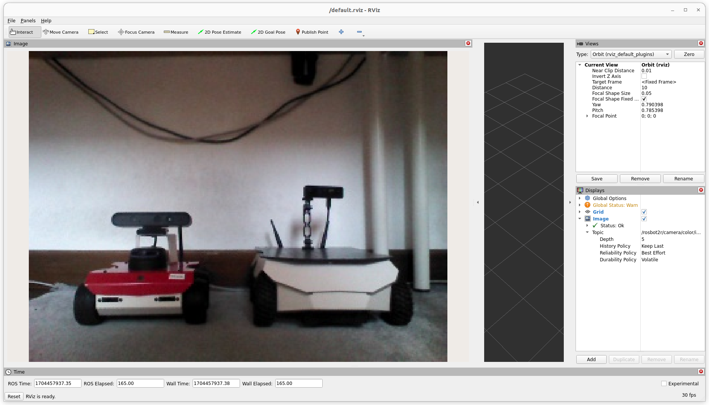
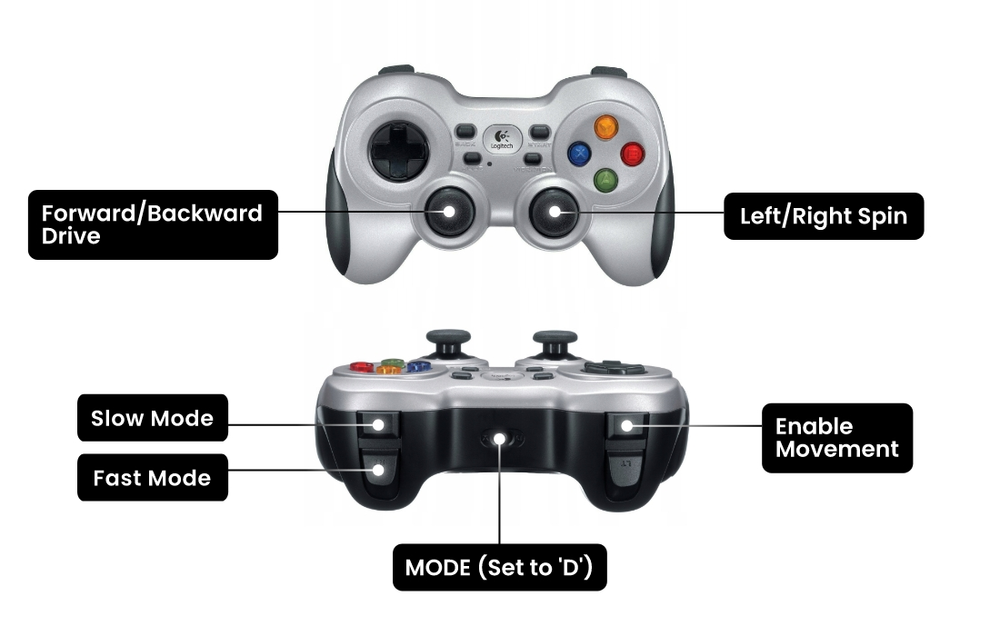

# rosbot-telepresence

Manual ROSbot Driving over the Internet with Real-Time Camera Feed



> [!NOTE]
> There are two setups on two separate branches available
> | branch name | description |
> | - | - |
> | [**ros2router**](https://github.com/husarion/rosbot-telepresence/tree/ros2router) (the current one)| Running ROS 2 containers on ROSbot and on PC with the interface in RViz |
> | [**foxglove**](https://github.com/husarion/rosbot-telepresence/tree/foxglove) | Running ROS 2 containers only on ROSbot with a web user interface powered by Foxglove |

## 🛍️ Necessary Hardware

For the execution of this project **[ROSbot 2R or ROSbot 2 PRO](https://husarion.com/manuals/rosbot/)** is required. 

You can find it at [our online store](https://store.husarion.com/collections/robots/products/rosbot).

## Quick start

> [!NOTE]
> To simplify the execution of this project, we are utilizing [just](https://github.com/casey/just).
>
> Install it with:
>
> ```bash
> curl --proto '=https' --tlsv1.2 -sSf https://just.systems/install.sh | sudo bash -s -- --to /usr/bin
> ```

To see all available commands just run `just`:

```bash
husarion@rosbot2r:~/rosbot-telepresence$ just
Available recipes:
    connect-husarnet joincode hostname # connect to Husarnet VPN network
    flash-firmware    # flash the proper firmware for STM32 microcontroller in ROSbot 2R / 2 PRO
    start-rosbot      # start containers on ROSbot 2R / 2 PRO
    start-pc          # start containers on PC
    run-teleop        # run teleop_twist_keybaord (host)
    run-teleop-docker # run teleop_twist_keybaord (inside rviz2 container)
    run-joy           # enable the F710 gemapad (connected to your PC) to control ROSbot
    sync hostname="${ROBOT_NAMESPACE}" password="husarion" # copy repo content to remote host with 'rsync' and watch for changes
```

### 🌎 Step 1: Connecting ROSbot and Laptop over VPN

Ensure that both ROSbot 2R (or ROSbot 2 PRO) and your laptop are linked to the same Husarnet VPN network. If they are not follow these steps:

1. Setup a free account at [app.husarnet.com](https://app.husarnet.com/), create a new Husarnet network, click the **[Add element]** button and copy the code from the **Join Code** tab.

2. Run in the linux terminal on your PC:

   ```bash
   cd rosbot-telepresence/ # remember to run all "just" commands in the repo root folder
   export JOINCODE=<PASTE_YOUR_JOIN_CODE_HERE>
   just connect-husarnet $JOINCODE my-laptop
   ```

3. Run in the linux terminal of your ROSbot:

   ```bash
   export JOINCODE=<PASTE_YOUR_JOIN_CODE_HERE>
   sudo husarnet join $JOINCODE rosbot2r
   ```

> [!NOTE]
> That `rosbot2r` is a default ROSbot hostname used in this project. If you want to change it, edit the `.env` file and change
>
> ```bash
> ROBOT_NAMESPACE=rosbot2r
> ```

### 📡 Step 2: Sync

Copy the local changes (on PC) to the remote ROSbot

```bash
just sync
```

> [!NOTE]
> This `just sync` automatically sync to device described by `ROBOT_NAMESPACE` inside `.env` file. Script locks the terminal and synchronizes online all changes made locally on the robot.

### 💻 Step 3: Launching the Control Interface on PC

At first start the ROS 2 Router and RViz:

```bash
just start-pc
```

And run `teleop_twist_keyboard` directly on the host OS or in Docker (choose one option):

```bash
just run-teleop-docker
# or
# just run-teleop
```

### 🤖 Step 4: Launching the Containers on ROSbot

> Execute the commands below in the ROSbot's shell (you can access it with `ssh husarion@rosbot2r`)

Inside `rosbot-telepresence` run below command to flash the right version of the firmware:

```bash
just flash-firmware
```

And run the containers

```bash
just start-rosbot
```

## Useful tips

### 1. Using Logitech F710 gamepad

Rather than employing the `teleop_twist_keyboard` ROS 2 package, you have the option to use the Logitech F710 gamepad. To utilize it, plug it into your PC's USB port and launch the `joy2twist` container on your PC:

```bash
just run-joy
```



### 2. Checking a datarate

To assess the data rate of a video stream being transmitted over the Husarnet VPN (which appears in your OS as the `hnet0` network interface), execute the following:

```bash
husarion@rosbot:~$ ifstat -i hnet0
      wlan0
 KB/s in  KB/s out
    6.83   2744.66
    1.67   2659.88
    1.02   2748.40
```

### 3. Sending uncompressed video frames over the network

If raw image data is being transmitted over the network, you need to perform some [DDS-tunning](https://docs.ros.org/en/humble/How-To-Guides/DDS-tuning.html) (both on ROSbot and PC):

For configs in LAN:

```bash
sudo sysctl -w net.ipv4.ipfrag_time=3 # 3s
sudo sysctl -w net.ipv4.ipfrag_high_thresh=134217728 # (128 MB)
```

For configs over VPN:

```bash
sudo sysctl -w net.ipv6.ip6frag_time=3 # 3s
sudo sysctl -w net.ipv6.ip6frag_high_thresh=134217728 # (128 MB)
```

## Troubleshooting

### `Packet was not a Theora header` warning

The log from your computer where you launched `compose.pc.yaml` may contain the following message:

```bash
[WARN] [1704479601.591809892] [rviz]: [theora] Packet was not a Theora header
```

Due to an issue in the theora codec, headers are probably sent only at the start. If you've initiated `compose.pc.yaml` following `compose.yaml`, it's essential to restart the `astra` service on ROSbot.

To do so, execute in the ROSbot's terminal in the `/home/husarion/rosbot-telepresence` folder the following line:

```bash
docker compose restart astra
```
