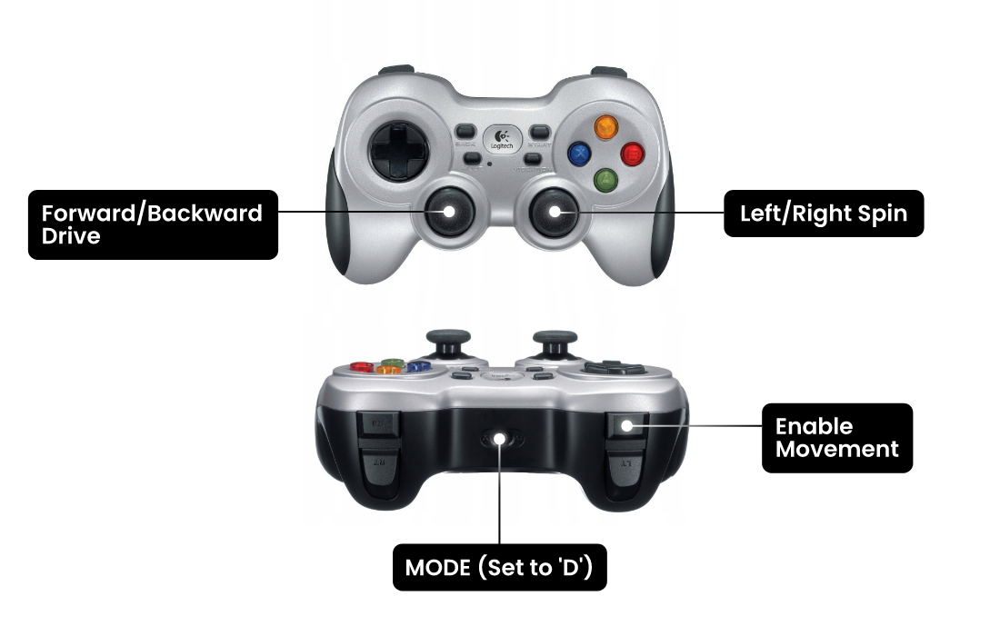

# rosbot-telepresence

Manual ROSbot Driving over the Internet with Real-Time Camera Feed


There are two different setups on two separate branches:

- [**ros2router**](https://github.com/husarion/rosbot-telepresence/tree/ros2router) (the current one)
- [**foxglove**](https://github.com/husarion/rosbot-telepresence/tree/foxglove)

## Quick start

### 🌎 Step 1: Connecting ROSbot and Laptop over VPN

Ensure that both ROSbot 2R (or ROSbot 2 PRO) and your laptop are linked to the same Husarnet VPN network. If they are not follow these steps:

1. Setup a free account at [app.husarnet.com](https://app.husarnet.com/), create a new Husarnet network, click the **[Add element]** button and copy the code from the **Join Code** tab.
2. Connect your laptop to the [Husarnet network](https://husarnet.com/docs). If you are Ubuntu user, just run:

   ```bash
   curl https://install.husarnet.com/install.sh | sudo bash
   ```

   and connect to the Husarnet network with:

   ```bash
   sudo husarnet join <paste-join-code-here>
   ```

3. Connect your ROSbot to the Husarnet network. Husarnet is already pre-installed so just run:

   ```bash
   sudo husarnet join <paste-join-code-here> rosbot2r
   ```

   > note that `rosbot2r` is a default ROSbot hostname used in this project. If you want to change it, edit the `.env` file

### 📁 Step 2: Cloning the Repo

This repository contains the Docker Compose setup for both PC and ROSbot. You can clone it to both PC and ROSbot, or use the `./sync_with_rosbot.sh` script to clone it to your PC and keep it synchronized with the robot

```bash
git clone https://github.com/husarion/rosbot-telepresence
cd rosbot-telepresence
export ROSBOT_HOSTNAME=rosbot2r # Replace with your own Husarnet hostname
./sync_with_rosbot.sh $ROSBOT_HOSTNAME
```

Edit `.env` file and write down the ROSbot 2R Husarnet hostname here to let the PC part know how to find the ROSbot 2R.

```bash
ROBOT_NAMESPACE=rosbot2r
```

### 💻 Step 3: Launching the Control Interface on PC

At first start the ROS 2 Router:

```bash
docker compose -f compose.pc.yaml up ros2router -d
```

And run `rviz2` and  `teleop_twist_keyboard` directly on the host OS or in Docker (choose one option):

#### Docker

1. Running `rviz2`:

   ```bash
   xhost +local:docker && \
   docker compose -f compose.pc.yaml up rviz
   ```

2. Running `teleop_twist_keyboard`:

   ```bash
   docker compose -f compose.pc.yaml run --rm -it rviz ros2 run teleop_twist_keyboard teleop_twist_keyboard --ros-args -r __ns:=/rosbot2r
   ```

#### Host

1. Running `rviz2`:

   ```bash
   export FASTRTPS_DEFAULT_PROFILES_FILE=$(pwd)/shm-only.xml
   rviz2 -d ./default.rviz
   ```

2. Running `teleop_twist_keyboard`:

   ```bash
   export FASTRTPS_DEFAULT_PROFILES_FILE=$(pwd)/shm-only.xml
   ros2 run teleop_twist_keyboard teleop_twist_keyboard --ros-args -r __ns:=/rosbot2r
   ```

### ⚙️ Step 4: Flashing the ROSbot Firmware

SSH to the ROSbot's shell:

```bash
ssh husarion@$ROSBOT_HOSTNAME
```

and execute:

```bash
./flash_rosbot_firmware.sh
```

### 🤖 Step 5: Launching the Containers on ROSbot

```bash
docker compose up
```

## Useful tips

### 1. Checking a datarate

To assess the data rate of a video stream being transmitted over the Husarnet VPN (which appears in your OS as the `hnet0` network interface), execute the following:

```bash
husarion@rosbot:~$ ifstat -i hnet0
      wlan0
 KB/s in  KB/s out
    6.83   2744.66
    1.67   2659.88
    1.02   2748.40
    6.73   2565.20
    1.02   2748.65
    1.18   2749.64
```

### 2. Sending uncompressed video frames over the network

If raw image data is being transmitted over the network, you need to perform some [DDS-tunning](https://docs.ros.org/en/humble/How-To-Guides/DDS-tuning.html) (both on ROSbot and PC):

For configs in LAN:

```bash
sudo sysctl -w net.ipv4.ipfrag_time=3 # 3s
sudo sysctl -w net.ipv4.ipfrag_high_thresh=134217728 # (128 MB)
```

For configs over VPN:

```bash
sudo sysctl -w net.ipv6.ip6frag_time=3 # 3s
sudo sysctl -w net.ipv6.ip6frag_high_thresh=134217728 # (128 MB)
```

### 3. Using Logitech F710 gamepad

Rather than employing the `teleop_twist_keyboard` ROS 2 package, you have the option to use the Logitech F710 gamepad. To utilize it, plug it into your PC's USB port and launch the `joy2twist` container on your PC:

```bash
docker compose -f compose.pc.yaml up joy2twist
```



## Troubleshooting

###  `Packet was not a Theora header` warning

The log from your computer where you launched `compose.pc.yaml` may contain the following message:

```bash
[WARN] [1704479601.591809892] [rviz]: [theora] Packet was not a Theora header
```

Due to an issue in the theora codec, headers are probably sent only at the start. If you've initiated `compose.pc.yaml` following `compose.yaml`, it's essential to restart the `astra` service on ROSbot.

To do so, execute in the ROSbot's terminal in the `/home/husarion/rosbot-telepresence` folder the following line:

```bash
docker compose restart astra
```
