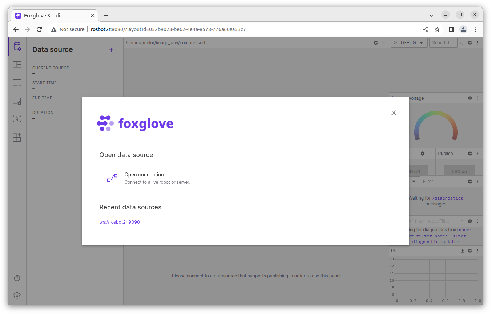

# rosbot-telepresence

Manual ROSbot Driving over the Internet with Real-Time Camera Feed


## Step 1: Connecting ROSbot and laptop over VPN

Ensure that both ROSbot 2R and PRO are linked to the same Husarnet VPN network. If they are not follow these steps:

1. Setup a free account at [app.husarnet.com](https://app.husarnet.com/), create a new Husarnet network, click the **[Add element]** button and copy the code from the **Join Code** tab.
2. Connect your laptop to the [Husarnet network](https://husarnet.com/docs). If you are Ubuntu user, just run:

   ```bash
   curl https://install.husarnet.com/install.sh | sudo bash
   ```

   and connect to the Husarnet network with:

   ```bash
   sudo husarnet join <paste-join-code-here>
   ```

3. Connect your ROSbot to the Husarnet network. Husarnet is already pre-installed so just run:

   ```bash
   sudo husarnet join <paste-join-code-here> rosbot2r
   ```

   > note that `rosbot2r` is a Husarnet hostname that is hardcoded in the [compose.pc.yaml](/rosbot-telepresence/blob/main/compose.pc.yaml) file. If you want a different hostname for your ROSbot remember to change it.
 

## Step 2: Clonning the repo

This repository contains the Docker Compose setup for ROSbot. 

SSH to ROSbot first:

```bash
ssh husarion@rosbot2r # if rosbot2r is Husarnet hostname you assigned for ROSbot in the Step 1
```

And inisde ROSbot's shell execute:

```bash
git clone https://github.com/husarion/rosbot-telepresence
cd rosbot-telepresence 
```

Pull all needed Docker images:

```bash
docker compose pull
```

## Step 3: Flashing the ROSbot Firmware

Execute in the ROSbot's shell:

```bash
./flash_rosbot_firmware.sh
```

## Step 4: Launching

Execute in the ROSbot's shell:

```bash
docker compose up
```

## Step 5: Open the web UI

Open the **Google Chrome** browser on your laptop and navigate to:

http://rosbot2r:8080

In the left column, click the **[+]** button adjacent to Data source. This will display:



Next, select the **[Open connection]** button, revealing:


The `WebSocket URL` field should already be populated. Simply press the **[Open]** button, and the web UI of your ROSbot will appear:


## Usefull tips

**1. Checking a datarate**

To assess the data rate of a video stream being transmitted over the Husarnet VPN (which appears in your OS as the `hnet0` network interface), execute the following:

```bash
husarion@rosbot:~$ ifstat -i hnet0
      wlan0       
 KB/s in  KB/s out
    6.83   2744.66
    1.67   2659.88
    1.02   2748.40
    6.73   2565.20
    1.02   2748.65
    1.18   2749.64
```

**2. Sending uncompressed video frames over the network**

If raw image data is being transmitted over the network, you need to perform some [DDS-tunning](https://docs.ros.org/en/humble/How-To-Guides/DDS-tuning.html) (both on ROSbot and PC):

For configs in LAN:

```bash
sudo sysctl -w net.ipv4.ipfrag_time=3 # 3s
sudo sysctl -w net.ipv4.ipfrag_high_thresh=134217728 # (128 MB)
```

For configs over VPN:

```bash
sudo sysctl -w net.ipv6.ip6frag_time=3 # 3s
sudo sysctl -w net.ipv6.ip6frag_high_thresh=134217728 # (128 MB)
```

